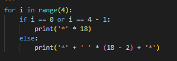
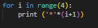
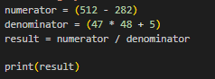
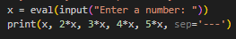
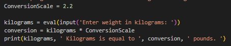
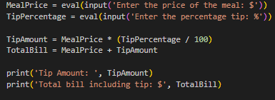

# Homework 1

This repository contains homework 1 completed for the Python 1 Certificate course at Bradley University. The course covers the fundamentals of programming using Python.

## Code Snippet 1.A

Description:
This snippet prints a box pattern using asterisks.

## Code Snippet 1.B

Description:
This snippet prints a triangle pattern of asterisks.

## Code Snippet 1.C

Description:
This snippet computes and prints a mathematical expression.

## Code Snippet 2

Description:
This snippet takes user input and prints multiples of the input separated by dashes.

## Code Snippet 3.A

Description:
This snippet converts weight from kilograms to pounds based on user input

## Code Snippet 3.B

Description:
This snippet calculates the tip amount and total bill including tip based on user input for meal price and tip percentage.
