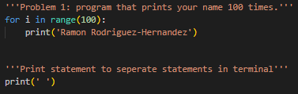
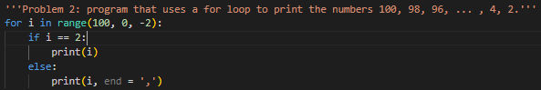
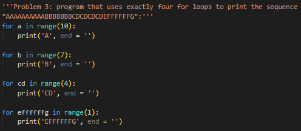
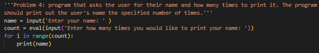
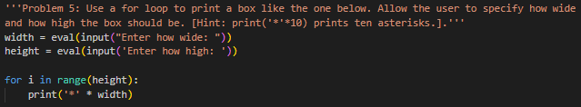
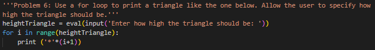
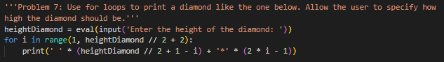

# Homework 2

This repository contains homework 2 completed for the Python 1 Certificate course at Bradley University. The course covers the fundamentals of programming using Python.

## Code Snippet 1

Description:
This program prints your name 100 times.

## Code Snippet 2

Description:
This program uses a for loop to print the numbers 100, 98, 96, ..., 4, 2.

## Code Snippet 3

Description:
This program prints the sequence "AAAAAAAAAABBBBBBBCDCDCDCDEFFFFFFG" using exactly four for loops.

## Code Snippet 4

Description:
This program asks the user for their name and how many times to print it, then prints the name the specified number of times.

## Code Snippet 5

Description:
This program uses a for loop to print a box. The user specifies the width and height of the box.

## Code Snippet 6

Description:
This program uses a for loop to print a triangle. The user specifies the height of the triangle.

## Code Snippet 7

Description:
This program uses for loops to print a diamond. The user specifies the height of the diamond.
