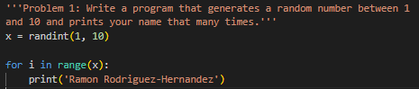
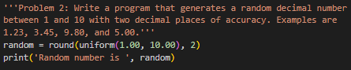
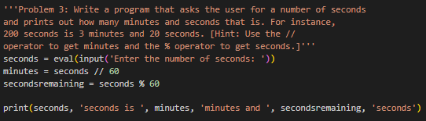
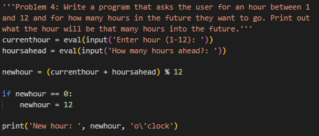
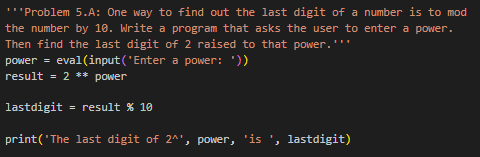
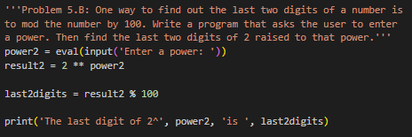
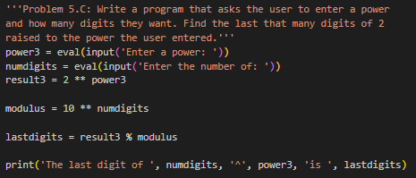
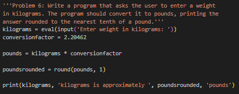
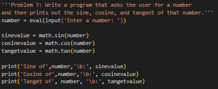
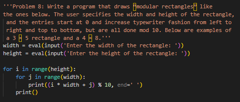

# Homework 3

This repository contains homework 3 completed for the Python 1 Certificate course at Bradley University. The course covers the fundamentals of programming using Python.

## Code Snippet 1

Description:
Generate a random number between 1 and 10 and print a name that many times.

## Code Snippet 2

Description:
Generate a random decimal number between 1 and 10 with two decimal places.

## Code Snippet 3

Description:
Convert seconds input into minutes and seconds format.

## Code Snippet 4

Description:
Calculate the future hour based on current hour and hours ahead input.

## Code Snippet 5.A

Description:
Last digit of 2 raised to a power.

## Code Snippet 5.B

Description:
Last two digits of 2 raised to a power.

## Code Snippet 5.C

Description:
Last specified digits of 2 raised to a power.

## Code Snippet 6

Description:
Convert weight in kilograms to pounds rounded to the nearest tenth.

## Code Snippet 7

Description:
Compute sine, cosine, and tangent of a user-input number.

## Code Snippet 8

Description:
Generate modular rectangles based on user-defined width and height.

